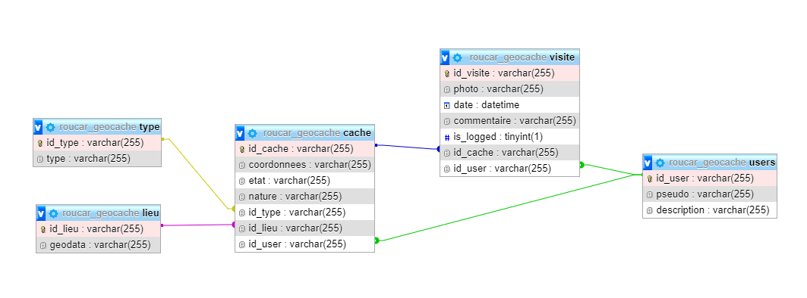

# Compte rendu - Projet POO Geo Cache - Guillaume Carlier et Romain Rousseaux

## Sommaire

1. Contexte
2. Diagramme UML
3. Schéma de base de données
4. Application

## Contexte

Dans le cadre de la matière de programmation orientée objet, nous devons réaliser une application CLI de manipulation de données dans le cadre de [Geo Caches](https://www.geocaching.com/play).

Cette application doit permettre de manipuler et de tester l'accès aux données d'une part sous une base de données MYSQL mais aussi sous une base de données MongoDB. Le changement doit pouvoir s'effectuer rapidement et simplement.

## Diagramme UML

A la lecture du [sujet](https://docs.google.com/document/d/1R0VKU8B_MBwd9IO3zw2xZxOqlmGzq44UGww0qH3eRUc/edit), on peut faire ressortir 4 grandes entités pour notre modèle :

- Les **lieux**, comprenant des données géographiques sur le lieu de la cache
- Les **caches**, comprenant toutes les informations sur les caches en elles-mêmes (description, type, nature, propriétaire ...)
- Les **utilisateurs**, comprenant les informations propres aux personnes telles que leur pseudo, une description ou encore une photo
- Les **visites**, comprenant une photo, une date, un commentaire ainsi qu'une information sur la découverte possible de la cache

Afin de compléter notre modèle, nous allons créer une entité pour représenter l'ensemble des **types** de nos caches pour des soucis de scalabilité.

On obtient alors un diagramme UML comme suit :

## Schéma de base de données

Ainsi, nous avons pu créer notre base de données MYSQL comme suit : 

## Mise en place du DAO

Nous avons réfléchi à un moyen facile de passer de MySQL à MongoDB, pour ceci, nous avons donc choisi de suivre ce schéma :

 

Une fois avoir fait la partie JPA, nous avons fait la partie Mongo de la même manière. Ainsi, nous avons une classe JpaDAO et une classe MongoDAO. 

La différence entre ces deux classes est la méthode pour récupérer les données. Et oui, il faut d'un côté créer une session et un EntityManager (JPA) et de l'autre, il faut créer une connexion à la base Mongo via un MongoClient.

Du côté de JPA, nous pouvons directement intéragir avec les entités et la base de données via les annotations; par contre du côté de mongo 

De même, pour chaque entité, il y a une classe JpaEntityDao et une classe MongoEntityDao.