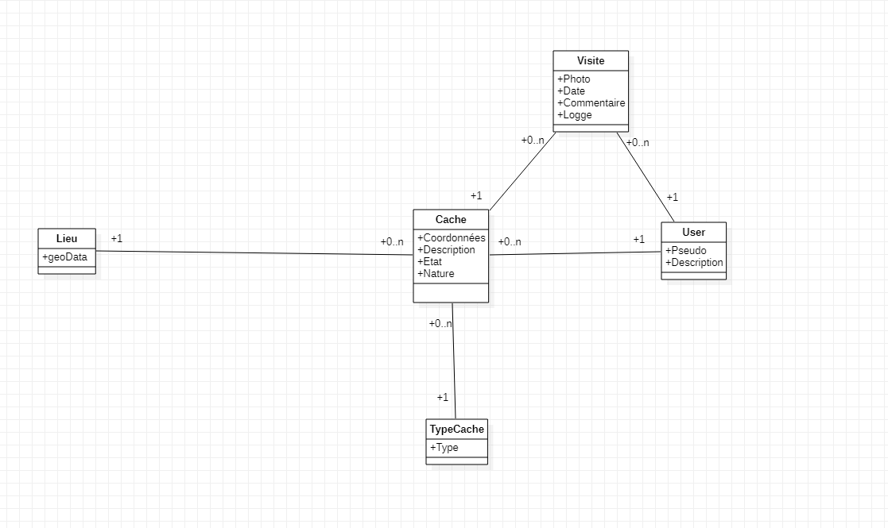
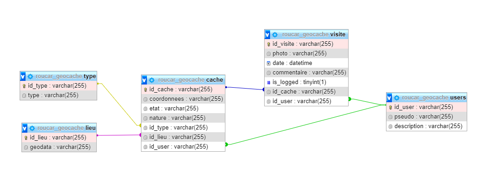
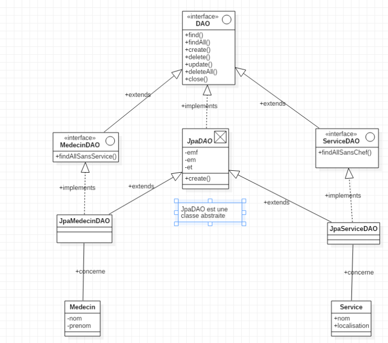

# Compte rendu - Projet POO Geo Cache - Guillaume Carlier et Romain Rousseaux

## Installation

- Clone le projet
- Nous utilisons Maven pour la gestion des dépendances, il faut donc identifier le projet comme Maven à son ouverture (IntelliJ le propose en bas à droite quand le projet est ouvert)
- Installer la base de données MySQL via le script fourni *roucar_geocache.sql*
- Copier coller le fichier *src/main/ressources/hibernate.cfg.xml.dist* en *src/main/ressources/hibernate.cfg.xml* et l'éditer pour la configuration des accès de la base de données : user / password / URL
- Installer MongoDB Compass et disposer d'un cluster prêt
- Exécuter la classe *Main.java* 

## Sommaire

1. Contexte
2. Diagramme UML
3. Schéma de base de données
4. Application

## Contexte

Dans le cadre de la matière de programmation orientée objet, nous devons réaliser une application CLI de manipulation de données dans le cadre de [Geo Caches](https://www.geocaching.com/play).

Cette application doit permettre de manipuler et de tester l'accès aux données d'une part sous une base de données MYSQL mais aussi sous une base de données MongoDB. Le changement doit pouvoir s'effectuer rapidement et simplement.

## Diagramme UML

A la lecture du [sujet](https://docs.google.com/document/d/1R0VKU8B_MBwd9IO3zw2xZxOqlmGzq44UGww0qH3eRUc/edit), on peut faire ressortir 4 grandes entités pour notre modèle :

- Les **lieux**, comprenant des données géographiques sur le lieu de la cache
- Les **caches**, comprenant toutes les informations sur les caches en elles-mêmes (description, type, nature, propriétaire ...)
- Les **utilisateurs**, comprenant les informations propres aux personnes telles que leur pseudo, une description ou encore une photo
- Les **visites**, comprenant une photo, une date, un commentaire ainsi qu'une information sur la découverte possible de la cache

Afin de compléter notre modèle, nous allons créer une entité pour représenter l'ensemble des **types** de nos caches pour des soucis de scalabilité.

On obtient alors un diagramme UML comme suit :



## Schéma de base de données

Ainsi, nous avons pu créer notre base de données MYSQL comme suit : 




On y retrouve alors nos 5 entités définies précédemment ainsi que les relations de clés étrangères qui y sont associées.

Nous avons fait le choix de partir sur des clés primaires de type varchar pour faciliter la bascule entre MySQL et MongoDB car Mongo n'utilise pas de clé primaire *int* mais un UUID à la place. Ainsi, on vient normaliser cela en utilisant uniquement des UUID.

## Architecture

Nous pouvons dorénavant initialiser le projet et mettre en place notre architecture technique :


|  Dossier   | Description                                                  |
| :--------: | ------------------------------------------------------------ |
|    Test    | Classes de test de notre application. <br />On y retrouvera les classes de tests pour JPA, Mongo ou encore les entités en général. |
|  Console   | Classe de notre application Console.                         |
|    DAO     | Ensemble de nos classes et interfaces pour la mise en place de notre DAO.<br />On pourra y retrouver le découpage présenté ci-dessous. |
|  Modeles   | Classes entités pour représenter nos données en BDD          |
| ressources | Fichiers de configuration de *hibernate.cfg.xml*             |

## Mise en place du DAO

Nous avons réfléchi à un moyen facile de passer de MySQL à MongoDB, pour ceci, nous avons donc choisi de suivre ce [schéma](https://docs.google.com/presentation/d/1pJQDSPMUckI6nWH0LvOvdpgvMtrT_ClDD3Gubtnpsmc/edit#slide=id.g4cb78a8372_0_0) :



 Ainsi, nous avons adapté ce schéma à notre modèle de données et avons obtenu les classes et interfaces suivantes : 


Nous avons fait le choix de découper de façon bien distincte nos classes JPA/Mongo. Mais comme celles-ci implémentent les mêmes interfaces, nous passerons alors par les interfaces pour les instancier.

## Implémentation 

### JPA

Afin de pouvoir utiliser notre DAO et les outils de JPA persistence, nous avons dans la classe *JpaDao.java* qui implémente l'interface *Dao.java*. C'est la classe abstraite générique qui contient l'ensemble de nos méthodes pour mettre en place le CRUD. 

Nous allons donc ici utiliser hibernate pour lier nos entités avec notre base de données. Nous allons donc instancier notre session lors de la création de notre classe :

```java
package dao;

import org.hibernate.HibernateException;
import org.hibernate.Session;
import org.hibernate.SessionFactory;
import org.hibernate.cfg.Configuration;

import javax.persistence.EntityManager;
import javax.persistence.criteria.CriteriaBuilder;
import javax.persistence.criteria.CriteriaQuery;
import javax.persistence.criteria.Root;
import java.util.Collection;

public abstract class JpaDao<T> implements Dao<T> {

    private SessionFactory sessionFactory;
    private Session session;

    protected static EntityManager _em;
    protected Class<T> classEntity;

    public JpaDao(Class<T> entity) {
        try {
            Configuration configuration = new Configuration();
            configuration.configure();

            sessionFactory = configuration.buildSessionFactory();
            this.classEntity = entity;
        } catch (Throwable ex) {
            throw new ExceptionInInitializerError(ex);
        }
    }
    .....
}
```

Ainsi, puisque toutes nos classes de type *JpaXxxxDao.java* étendent cette classe, nous avons accès à notre session que nous pouvons ouvrir ou fermer à volonté via les méthodes suivantes :

```java
 	public void openSession() {
        session = sessionFactory.openSession();
        _em = session.getEntityManagerFactory().createEntityManager();
    }

    public void closeSession() {
        if (null != session) {
            session.close();
        }
    }
```

De fait, dans la classe *Test2.java*, on trouve des exemple de comment utiliser ces outils :

```java
    private static void createUser() {
        JpaUserDao jpaUserDao = new JpaUserDao(); 
        try {
            jpaUserDao.openSession();
            Faker faker = new Faker(new Locale("fr"));
            User user = new User(UUID.randomUUID().toString(), faker.gameOfThrones().dragon(), faker.backToTheFuture().quote());
            if(jpaUserDao.create(user)) {
                System.out.println("User created");
            }
        }
        finally {
            jpaUserDao.closeSession();
        }
    }
```

### MongoDB

Une fois avoir fait la partie JPA, nous avons fait la partie Mongo de la même manière. Ainsi, nous avons une classe *JpaDAO* et une classe *MongoDAO*. 

La différence entre ces deux classes est la méthode pour récupérer les données. Il faut d'un côté créer une session et un EntityManager (JPA) et de l'autre, il faut créer une connexion à la base Mongo via un MongoClient.

Du côté de JPA, nous pouvions directement interagir avec les entités et la base de données via les annotations et l'EntityManager mentionné plus tôt; par contre du côté de Mongo, il faut créer un objet "Document" ou "BSON".
Cependant, après moultes recherches, nous avons trouvé une solution appelée ***[Morphia](https://github.com/MorphiaOrg/morphia)***, qui permet d'utiliser nos entités pour la sauvegarde dans MongoDB.

Exemple dans la classe *MongoDao.java* :
```java
Morphia morphia = new Morphia(); // on créé une instance de morphia
morphia.map(entity.getClass()); // on mappe cette instance a une classe

Datastore datastore = morphia.createDatastore(mongoClient,"geocache"); // on créé un datastore
datastore.save(entity); // on sauvegarde l'entité en passant par le datastore
```

De même, pour chaque entité, il y a une classe *JpaEntityDao* et une classe *MongoEntityDao*.

Ainsi, dans *Test3.java*, on retrouvera des exemples d'utilisation de ce modèle :

```java
    private static void createUser() {
        MongoUserDao mongoUserDao = MongoUserDao.getInstance();
        try {
            Faker faker = new Faker(new Locale("fr"));
            mongoUserDao.openSession();
            User user = new User(
                    UUID.randomUUID().toString(),
                    faker.gameOfThrones().dragon(),
                    faker.backToTheFuture().quote()
            );
            mongoUserDao.create(user);
        }
        finally {
            mongoUserDao.closeSession();
        }
    }
```

## Application Console

Maintenant que nos DAOs sont en place, il ne nous reste qu'à créer notre application console.

Nous avons fait le choix de faire une application interactive sur laquelle l'utilisateur choisit les actions qu'il veut réaliser sur quelles entités


Cependant, afin de choisir quelle DAO utiliser, la question est posée au lancement de la console, permettant alors d'instancier les classes adéquates 


```java
    private void initDao(String mode) {
        switch (mode.toLowerCase()) {
            case "jpa":
                daoMap.put("user", JpaUserDao.getInstance());
                daoMap.put("cache", JpaCacheDao.getInstance());
                daoMap.put("visite", JpaVisiteDao.getInstance());
                daoMap.put("type", JpaTypeDao.getInstance());
                daoMap.put("lieu", JpaLieuDao.getInstance());
                break;
            case "mongo":
                daoMap.put("user", MongoUserDao.getInstance());
                daoMap.put("cache", MongoCacheDao.getInstance());
                daoMap.put("visite", MongoVisiteDao.getInstance());
                daoMap.put("type", MongoTypeDao.getInstance());
                daoMap.put("lieu", MongoLieuDao.getInstance());
                break;
            default:
                System.out.println("Mauvais type demandé, merci de spécifier JPA ou Mongo");
                System.exit(-2);
        }
    }
```

On peut alors utiliser nos classes DAO via des appels comme suit :

```java
UserDao dao = (UserDao) daoMap.get("user");
dao.openSession();
```

Les actions de type création ou mise à jour sont prédéfinies et génèrent ou updatent les données de façon fixe.
